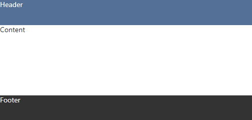

# react-html-layout

Layout for react page.

<a href="https://www.npmjs.com/package/react-html-layout">
    
</a>

## Usage

### Installation:

```
npm install react-html-layout
```

### Make sure you have next styles

Some browsers have default styles for `html` or `body` tags. We should be sure that below tags have:

```css
html,
body {
    margin: 0;
    padding: 0;
}
```

### Import

```js
import { Layout } from 'react-html-layout';
```

### Example

```html
<Layout header={<div>Header</div>} footer={<div>Footer</div>}>
    <div>Content</div>
</Layout>
```

<p style="text-align:center;">
    
</p>

-   [`header`](#header) and [`footer`](#footer) already contains default styles. For instance, header's styles can be overwitten with [`headerStyle`](#headerstyle) or [`headerClassName`](#headerclassname) properties.
-   Layout occupies whole visible page space, that's because it's heigth is `100vh`. The [`footer`](#footer) is always on the bottom of the page.
-   To make [`header`](#header) or [`footer`](#footer) fixed use [`fixedHeader`](#fixedheader) or [`fixedFooter`](#fixedfooter) properties.
-   If [`header`](#header) is fixed it's default heigth is `50px`. To change this value use [`fixedHeaderHeigth`](#fixedheaderheigth).

## Options

#### header

    Header content.

#### fixedHeader

    Toggles the header to has fixed position.

#### fixedHeaderHeigth

    Heigth of the fixed header.

#### headerClassName

    Header class name.

#### headerStyle

    Header styles.

#### footer

    Footer content.

#### fixedFooter

    Toggles the footer to has fixed position.

#### fixedFooterHeigth

    Heigth of the fixed footer.

#### footerClassName

    Footer class name.

#### footerStyle

    Footer styles.

#### content

    Content of the page.
