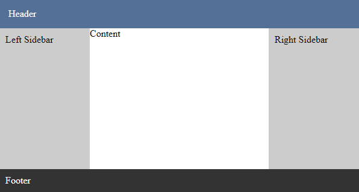

# react-html-layout

Basic react page layout.

<a href="https://www.npmjs.com/package/react-html-layout">
    
</a>

## Usage

### Installation:

```
npm install react-html-layout
```

### Make sure you have next styles

Some browsers have default styles for `html` or `body` tags. We should be sure that below tags have:

```css
html,
body {
    margin: 0;
    padding: 0;
}
```

## Layout

```jsx
import { Layout } from 'react-html-layout';
...
<Layout header={<div>Header</div>} footer={<div>Footer</div>}>
    <div>Content</div>
</Layout>
```

<div align="center">
    
</div>

-   [`header`](#header) and [`footer`](#footer) already contains default styles. For instance, header's styles can be overwitten with [`headerStyle`](#headerstyle) or [`headerClassName`](#headerclassname) properties.
-   Layout occupies whole visible page space, that's because it's heigth is `100vh`. The [`footer`](#footer) is always on the bottom of the page.
-   To make [`header`](#header) or [`footer`](#footer) fixed, use [`fixedHeader`](#fixedheader) or [`fixedFooter`](#fixedfooter) properties.
-   If [`header`](#header) is fixed it's default heigth is `50px`. To change this value use [`fixedHeaderHeigth`](#fixedheaderheigth).

### Options

| Name                  | type                     | Description                                     |
| --------------------- | ------------------------ | ----------------------------------------------- |
| `className`           | `string`                 | Root class name                                 |
| `style`               | `React.CSSProperties`    | Root style                                      |
| `contentClassName`    | `string`                 | Content class name                              |
| `contentStyle`        | `React.CSSProperties`    | Content style                                   |
| `header`              | `React.ReactNode`,`null` | Header content. Set `null` to hide default view |
| `fixedHeader`         | `boolean`                | Toggles the header to has fixed position        |
| `fixedHeaderHeigth`   | `number`                 | Heigth of the fixed header                      |
| `headerClassName`     | `string`                 | Header class name                               |
| `headerStyle`         | `React.CSSProperties`    | Header styles                                   |
| `footer`              | `React.ReactNode`,`null` | Footer content. Set `null` to hide default view |
| `fixedFooter`         | `boolean`                | Toggles the footer to has fixed position        |
| `fixedFooterHeigth`   | `number`                 | Heigth of the fixed footer                      |
| `footerClassName`     | `string`                 | Footer class name                               |
| `footerStyle`         | `React.CSSProperties`    | Footer styles                                   |
| `content`, `children` | `React.ReactNode`        | Content of the page                             |

## ContentWrapper

Centralized content with fixed width

```jsx
import { ContentWrapper } from 'react-html-layout';
...
<ContentWrapper width={300}>
    Content example. Content example. Content example.
</ContentWrapper>
```

<div align="center">
    
</div>

### Options

| Name       | type              | Description                |
| ---------- | ----------------- | -------------------------- |
| `width`    | `number`          | Heigth of the fixed header |
| `children` | `React.ReactNode` | Content                    |
